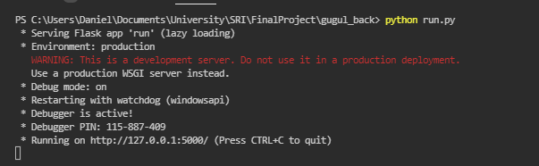
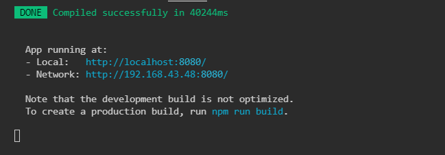
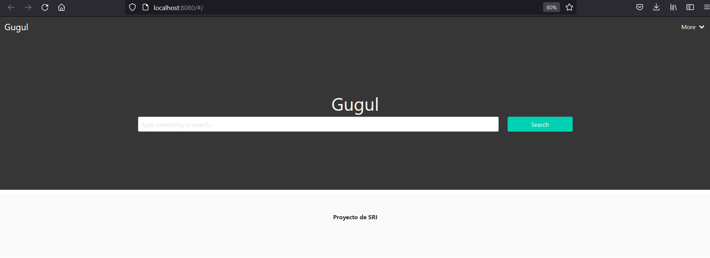
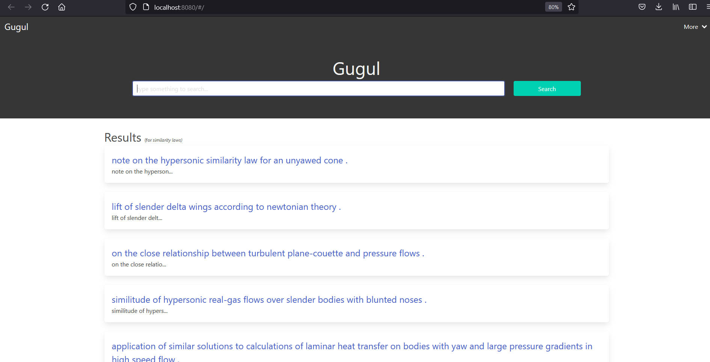
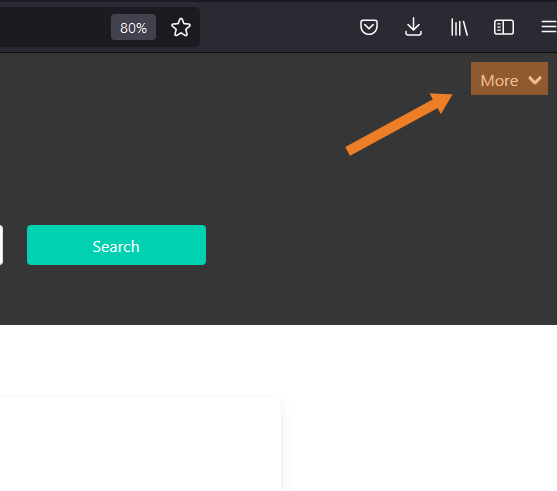
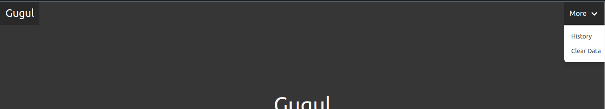
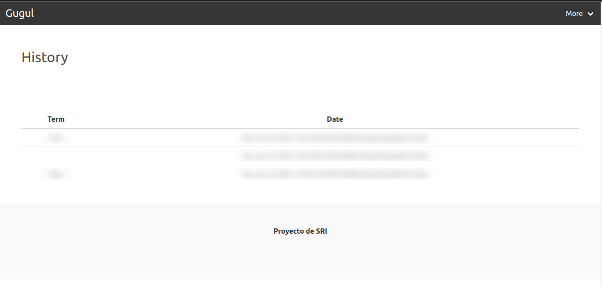
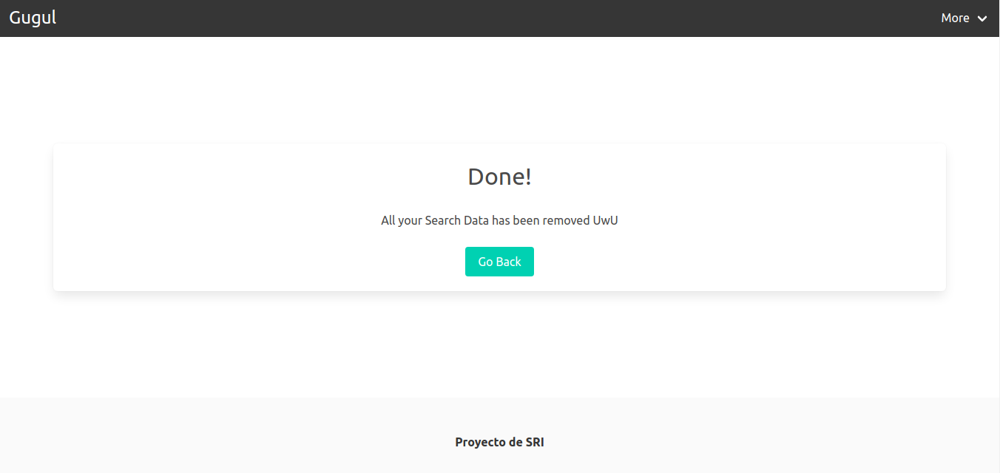
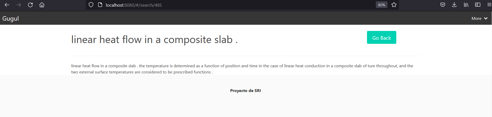

# Manual de usuario

Este repositorio es una api de Flask para brindar servicio de un buscador. El algoritmo implementado es el modelo vectorial para establecer la similitud de una query con todos los documentos del corpus.

## Requerimientos técnicos

Para el funcionamiento de la app es necesario tener un navegador web compatible con los estándares de los últimos años. Ademas de Python 3.10 con el siguiente conjunto de dependencias.

```
Flask
nltk
scikit_learn
numpy
```

Estos pueden ser instalados con los siguientes comando con el archivo requeriments.txt que se provee en la carpeta de la app.

### Instalar dependencias

```
pip install -r requirements.txt
```

De la biblioteca nltk es necesario tener instalado los siguientes modelos 


### Para correr la aplicación 
```
python run.py
```

### Para correr los test

  (Es necesario estar en la carpeta raíz del proyecto para esto)
```
python testers/<name>_tester.py
```


### Inicializacion del motor

La aplicación de Gugul back provee de los servicios a la aplicación de Gugul front para el funcionamiento del buscador de manera integra. Entonces para inicializar los servicios de Gugul back nos vamos la ruta donde se encuentra la solucion de gugul back y una vez ahi corremos el siguiente comando: 
```
python run.py
```
Esto nos va a cargar la aplicación y va a esperar por la palicacion de Gugul front para brindar los servicios de busqueda. La imagen siguiente muestra como corre en consola esta aplciacion:



### Instrucciones para correr la aplicación de gugul front

la aplicación que es interactiva con el usuario , es decir la que interactúa de manera gráfica con el usuario es la aplicación de gugul front que corre en el navegador.

Nos vamos hasta donde esta la raíz de esta aplicación y una vez ahi , si no se ha corrido nunca la aplicación hay que escribir unos comandos de inicialización para que el sistema se instale las cosas necesarias para que la aplicación levante correctamente. Es decir se van a instalar todas las dependencias para que al aplicación de Vue pueda correr sin problema ninguno en nuestra maquina.

Entonces si es la primera ves que se va a correr la aplicación debemos escribir primero esta comando:
```
npm install
```
Luego para montar el server y que la aplicación levante en nuestro navegador corremos el siguiente comando:

```
npm run server
```
si todo va bien debe de salir en consola algo similar a lo que nuestra la siguiente imagen: 



después de haber llegado hasta aquí si no se abrió una pagina nueva en el navegador con la aplicación , entonces ingresa en una nueva ventana en le navegador la siguiente dirección: 
```
http://localhost:8080/
```

### Pantalla principal 
Despues de haber cargado las dos aplicaciones correctamente en el navegador se mostrara una pagina como se muestra en la imagen siguiente:



### Pantalla de resultados
Si hacemos una busqueda se mostrara en la misma pagina todos los resultados que la aplicacion de Gugul back retorno como resultado de la query escrita por el usuario. Como se muestra en la siguiente imagen.



### Historial 

En la parte superior derecha del navegador (en la pagina principal hay un  apartado donde se puede hacer click y acceder al historial de querys que el usuario he hecho). Como se muestra en la figura siguiente: 


Si se despliega aquí aparece para ir al apartado del historial o al apartado de clear data . como se muestra en esta imagen: 



Si se abre el historial aparece una lista con la fecha en que fue hecha cada query . La pagina se vería algo parecido a como se muestra en la siguiente imagen: 



### Crear Data

Para borrar todos los datos que se han buscado podemos acceder desde el apartado de more en la pantalla principal y se borra todo el historial y todos los datos de la aplicación que esta corriendo en ese momento. debe aparecen una pagina que notifique como se muestra en la siguiente imagen:



### Pantalla de detalles

Una vez que se hace una búsqueda aparecen una serie de documentos , donde se puede dar clic y eso nos lleva a otra pagina donde se muestra el texto completo del documento que se quiere ver:



Si se presiona de nuevo en el botón **Go Back** que aparece de color verde a la derecha entonces se vuelve a la pantalla principal. 


### Diseño completo del sistema según cada etapa de la recuperación de información. debe especificar las consideraciones y argumentos para la elección y aplicación de los modelos y enfoques adoptados.

Decidimos trabajar el modelo vectorial porque es un modelo que ha demostrado ser eficiente en SRI con repositorios grandes y de variadas temáticas. En comparación con el modelo booleano es mejor para propósito general, pues para booleano es recomendado que la información que se trata de recolectar sea de un mismo tema, ademas de que es mas recomendable usar por expertos, no sucede asi con el vectorial, en cuyo caso puede ser usado fácilmente por usuarios no expertos.

Para el desarrollo del modelo usamos el esquema de ponderación *tf-idf* pues para los documentos este esquema mejora el rendimiento de la recuperación. La estrategia de coincidencia parcial que usa el modelo permite la recuperación de los documentos que mas se aproximen a los requerimientos de la consulta. La estrategia permite ordenar los documentos por orden de similitud con la consulta.

Un problema a resolver en el modelo es que  los términos indexados del documento son mutuamente independientes. Aunque en realidad existe relación entre algunos términos en el documento. Aunque podría significar una limitación del modelo simplifica el proceso de recuperación y en algunos casos mejora el rendimiento aunque a la hora de extracción el proceso no sea tan abstracto como sistemas mas inteligentes. El análisis de la correlación requiere que se tangan enfoques mas avanzados en el sistema.

### Presentación de las herramientas empleadas para la programación y aspectos mas importantes del código.

El proyecto esta dividido en dos aplicaciones. Una que es el sistema de recuperación y la otra que es la Api que consume los recursos para interactuar con el usuario.

#### Gugul_Back
Una aplicación usa Flask para generar un servicio que nos retornara dada una query todos los documentos que mas similitud tengan son esa query.


#### Estructura del proyecto
```
  |-test_collections (folder)
  |-testers (folder)
  |-collection_reader (folder)
  |-documents.py
  |-document_handler.py
  |-run.py
  |-REARME.md
  |-requierments.txt
```

La carpeta `test_collections` contiene lo asociado a distintas colecciones de datos para probar el modelo, por cada una de estas colecciones tenemos una representación de los documentos, una representación de las querys que se le van a hacer al sistema y una representación los documentos que debería resolver el sistema para cada query. 

La carpeta `collection_reader` contiene scripts encargados del parsing de cada colección de datos dentro de `test_collections`. 

La carpeta `testers` contiene scripts para el testeo del sistema con parámetros que creímos interesantes usando las colecciones de `test_collections`.


En `document_handler.py` esta la implementación del sistema. Esta implementación tiene una colección de documentos. A la hora de construir el contenedor se llaman a varias funciones que inicializan y realizan parte del proceso de la recuperación , como tokenizar el texto y extraer las frecuencias para posteriores cálculos con las consultas que se hagan.

En `documents.py` hay una clase que me representa un documentos para el corpus. Este representación del documento tiene un `id` (que me representa un entero único para identificar el documento) , un `title` el titulo del documento , `author` que me representan los autores del documento, `text` que me representa el cuerpo del documento.

En `run.py` ese encuentra una aplicación de flask sencilla para correr el sistema de recuperación como un servicio para ser consumido por otra aplicación `Gugul_Front` (que es el UI de la aplicación).

En `README.md` esta este documento con todo las partes de la implementación del sistema y algunas particularidades de esta solución.

En `requirements.txt` están los requerimientos de dependencias del proyecto que deben instalarse antes de que se corra la aplicación. el comando que debe correr se en el directorio del proyecto (es decir donde se encuentra el fichero ***requierements.txt***) es: ```pip install -r requirements.txt```


### Análisis crítico de las ventajas y desventajas del sistema desarrollado.

Se ha mostrado la arquitectura del modelo vectorial lo suficientemente abierto y flexible para ser usado en labores docentes, asi como investigaciones. La sencillez de esta arquitectura permitirá tanto la fácil observación de resultados y estructuras intermedias como la modificación y añadido de nuevos módulos y por tanto permite experimentar con el modelo. Puede ser usado en la docencia de algunas materias relacionadas directamente con la extracción automatizada de información.


### Recomendaciones para trabajos futuros que mejoren la propuesta.

Se puede trabajar en el reconocimiento de entidades que ayuden a una mejor vinculación entre diferentes token de los documentos que guardan relación y pueden brindar mucha información a la hora de determinar el peso de un documento en el ámbito de la búsqueda . También se puede trabajar en correcciones básicas como en interacciones con los usuarios que permitan al sistema saber que tan provechoso le fueron los resultado de la aplicación para una consulta dada, la información recolectada se podría usar para próximas consultas similares o iguales.


### Autores
1. [Daniel de la Cruz Prieto](https://github.com/dcruzp)
2. [Mauricio Salim Mahmud Sánchez](https://github.com/maux96)
